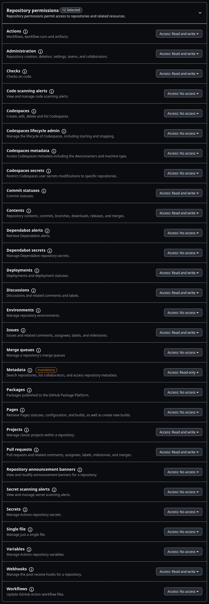
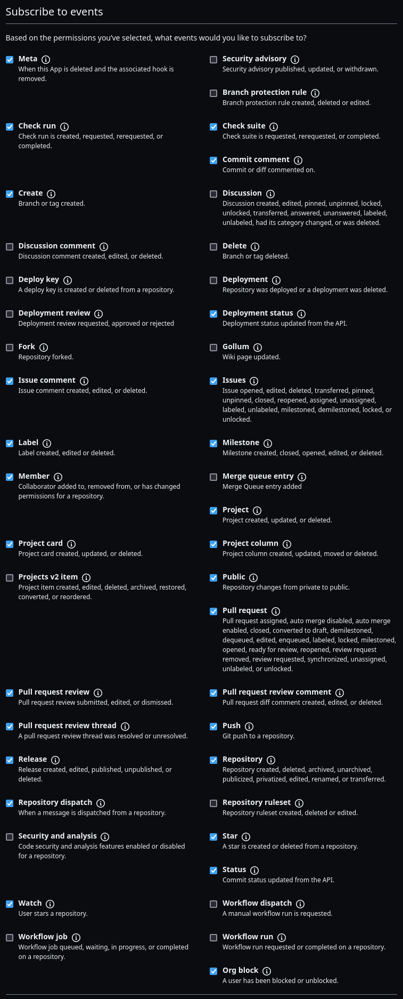

# Oppiabot

<p align="center">
    
</p>

Oppiabot is a GitHub app built with [probot](https://github.com/probot/probot). It acts as a helper for the Oppia code repository to maintain the development workflow. It is hosted on [Heroku](https://www.heroku.com/).


## Getting started

Please refer to the following instructions to setup Oppiabot for the first time on your machine:

1. Create a new folder called `opensource/` within your home folder (or use one that you already have). Navigate to it (`cd opensource`), then [fork and clone](https://help.github.com/articles/fork-a-repo/) the Oppiabot repo. This will create a new folder named `opensource/oppiabot`. Navigate to `opensource/oppiabot/`.

2. Install [Node.Js](https://nodejs.org/) and [NPM](https://www.npmjs.com/) on your machine using the following commands:

    First check if you already have Node.js and NPM using:
    ```bash
    node -v
    npm -v
    ```
    If these commands show some versions, then you can jump to Point No. 3, else proceed in this point:
    #### Using Ubuntu
    ```bash
    curl -sL https://deb.nodesource.com/setup_lts.x | sudo -E bash -
    sudo apt install -y nodejs
    ```
       
    #### Using MacOS
    ```bash
    sudo brew install node
    ```

    #### Using Windows
    Use [WSL with Ubuntu](https://learn.microsoft.com/en-us/windows/wsl/install) and then follow the Ubuntu instructions.
    
3. Setup probot and other dependencies by running the following command:
  ```bash
    npm install
  ```

4. The Oppiabot uses environment variables. These are configured in the server settings. To deploy the bot locally, create a `.env` file and copy the contents of `.env.example` to it. You will need to adjust these variables accordingly following the instructions in the subsequent steps. Run following command to copy `.env.example` to `.env`

If you have Linux terminal type:
  ```bash
    cp .env.example .env
  ```

5. Go to [smee.io](https://smee.io/) and click **Start a new channel**. Set `WEBHOOK_PROXY_URL` in `.env` to the URL that you are redirected to.

6. [Create a new GitHub App](https://github.com/settings/apps/new) with:
    * **GitHub App name**: Use something like "My Oppiabot testing App"
    * **Homepage URL**: Use any random URL
    * **Webhook URL**: Use your `WEBHOOK_PROXY_URL` from the previous step.
    * **Webhook Secret**: `development`
    * **Permissions & events** The following permissions and events must be subscribed. If, for example, you only enable issue events, you will not be able to listen on pull request webhooks with the bot.

<p align="center">
  
  
  
  
</p>

7. Download the private key. It will be a `.pem` file. Move it to the root directory of the project. As long as it's in the root directory, it will be automatically detected regardless of the filename.

Make sure you remove
 > PRIVATE_KEY=example_private_key

from .env file, Otherwise app will not work locally.

8. Edit `.env` and set `APP_ID` to the ID of the app you just created and also `WEBHOOK_SECRET` to `development`. The App ID can be found in your app settings page here.

<p align="center">
    
</p>


## Installing the bot on a repository

Example Scenario

Suppose you have a GitHub account with the username johndoe, and you want to install a bot on a repository named my-cool-project.

Step-by-Step Guide
1) Select and Install the Bot on Your Repository

a) Visit the settings page for your bot at https://github.com/settings/apps/your-bot-name/installations (replace your-bot-name with your bot's actual name).
b) Here, you’ll see an Install button next to each available repository.
c) Click on Install for your target repository. For example, if my-cool-project is the repository where you want to install the bot, click Install next to it.

2) Add Your Account to the .env File

a) Open the .env file in your project’s local directory. This file stores environment variables needed by your bot.
b) Add your GitHub account name (in this example, johndoe) to the WHITELISTED_ACCOUNTS entry. This allows the bot to recognize and interact with your account.
For example :- WHITELISTED_ACCOUNTS=johndoe

3) Specify Your Repository in constants.js

a) Open constants.js, which stores the bot’s configuration for each repository. Locate the checksWhitelist object, where each repository has its own configuration.
b) Add a new entry for your repository in lowercase (e.g., my-cool-project). Define the specific events and checks the bot should monitor for this repository.
Here’s how you can add my-cool-project to checksWhitelist:

const checksWhitelist = {
  // existing configurations for other repositories
  'oppia-android': { /* ... */ },
  'oppia': { /* ... */ },
  'oppiabot': { /* ... */ },

  // Add your new repository entry here
  'my-cool-project': {
    [openEvent]: [claCheck, assigneeCheck, branchCheck],
    [reopenEvent]: [branchCheck, mergeConflictCheck],
    [PRLabelEvent]: [prLabelCheck],
    [synchronizeEvent]: [mergeConflictCheck],
    [closeEvent]: [allMergeConflictCheck],
    [editEvent]: [wipCheck],
    [issuesLabelEvent]: [issuesLabelCheck],
    [issuesAssignedEvent]: [issuesAssignedCheck],
    [pushEvent]: [forcePushCheck],
    [pullRequestReviewEvent]: [pullRequestReviewCheck],
    [checkCompletedEvent]: [ciFailureCheck],
    [issueCommentCreatedEvent]: [respondToReviewCheck]
  }
};

This configuration will allow the bot to monitor specific events and perform actions for my-cool-project.


## Running the bot locally

You are now ready to run the bot on your local machine. Run `npm run dev` to start the server.
The `dev` script will start the bot using [nodemon](https://github.com/remy/nodemon#nodemon), which will watch for any files changes in your local development environment and automatically restart the server.

### Other available scripts

`npm start` to start the bot without watching files.


## Debugging
Always run `npm install` and restart the server if `package.json` has changed.
To turn on verbose logging, start server by running: `LOG_LEVEL=trace npm start`.
Run `npm test` to run all the tests locally.


## Support

If you have any feature requests or bug reports, please log them on our [issue tracker](https://github.com/oppia/oppiabot/issues/new?title=Describe%20your%20feature%20request%20or%20bug%20report%20succinctly&body=If%20you%27d%20like%20to%20propose%20a%20feature,%20describe%20what%20you%27d%20like%20to%20see.%20Mockups%20would%20be%20great!%0A%0AIf%20you%27re%20reporting%20a%20bug,%20please%20be%20sure%20to%20include%20the%20expected%20behaviour,%20the%20observed%20behaviour,%20and%20steps%20to%20reproduce%20the%20problem.%20Console%20copy-pastes%20and%20any%20background%20on%20the%20environment%20would%20also%20be%20helpful.%0A%0AIf%20the%20issue%20you%27re%20facing%20is%20probot-specific,%20it%20should%20be%20logged%20to%20the%20probot%20repository.%0A%0AThanks!).

Please report security issues directly to admin@oppia.org.

## License

The Oppiabot code is released under the [Apache v2 license](https://github.com/oppia/oppiabot/blob/master/LICENSE).
